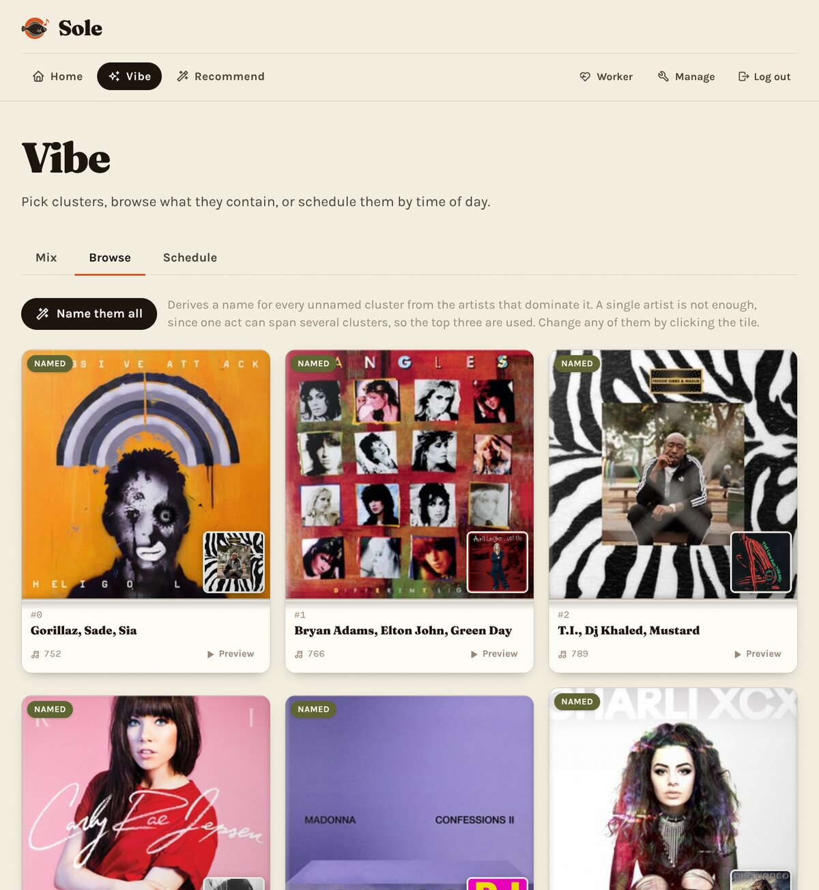
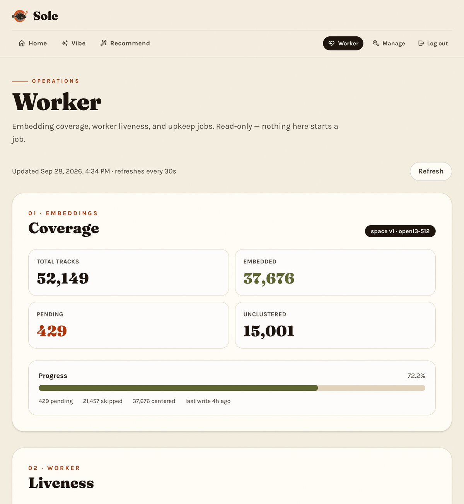
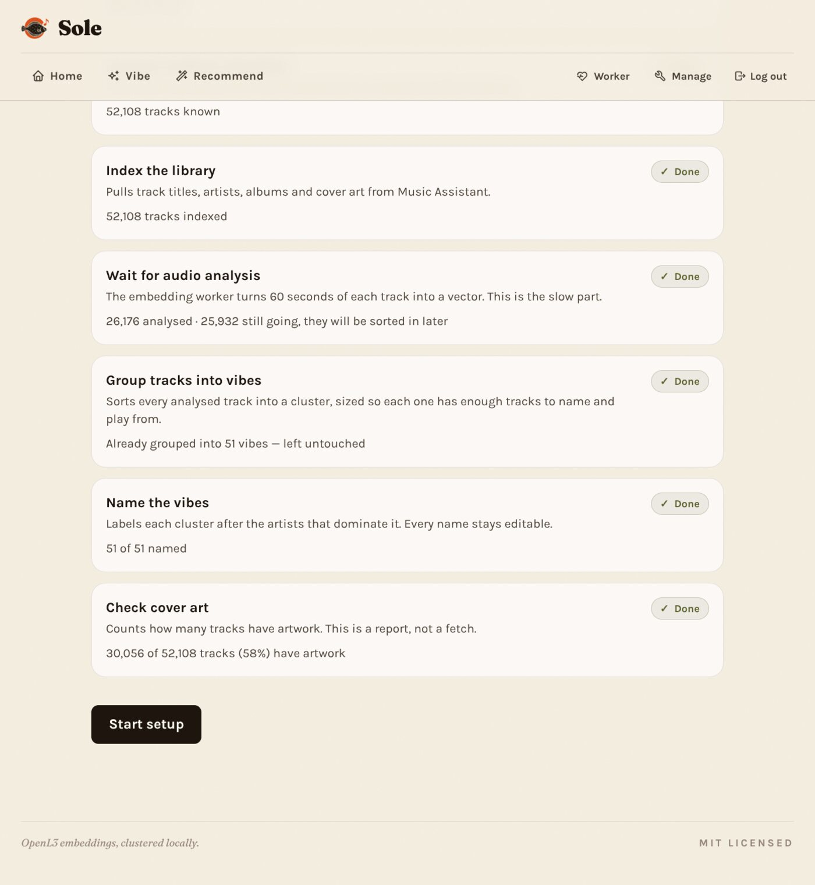

# Sole

[](https://github.com/poesterlin/sole/actions/workflows/ci.yml)
[](https://poesterlin.github.io/sole/)
[](LICENSE)

**Your music library, indexed by how it sounds instead of what it's tagged as.**

Sole runs [OpenL3](https://github.com/miraglab/OpenL3) — a self-supervised audio
model — over every track you own, stores the vectors in pgvector beside your
metadata, and clusters them into named *vibes*. You can browse those clusters as
cover art, search them by name, schedule one to play at a given hour, or seed a
single track and get things that sound like it. It runs on your own hardware.



## Why

Every music tool you already use is built around metadata somebody else wrote.
That works well right up until it doesn't: the misspelled artist, the tagged
"Live" version filed next to the studio cut, the bootleg with no tags at all, the
album you ripped years ago and never went back to. Tag-based search can only
return what a scrobbler already guessed.

An audio model doesn't care. It hears the track, so a badly tagged demo and a
correctly tagged one land next to each other if they sound alike. OpenL3 is
self-supervised, which means it needed no training set and no labels — it learned
from unlabelled audio, so you don't need to have scrobbled anything to use it.

## What it does

- **Vibe** — clusters your library by sound and names each one after the artists
  that dominate it, so you get "Sade, Gorillaz, Sia" instead of "Cluster 0". Browse
  the lot, filter by name, or schedule a cluster to play between two hours.
- **Recommend** — name one track, get the tracks that sit nearest it in embedding
  space.
- **Worker** — embedding coverage and worker liveness. Entirely read-only; nothing
  on that page can start a job.
- **Manage** — library upkeep, duplicate pruning, and scoped API keys.

Playback is handed to [Music Assistant](https://www.music-assistant.io/), which
Sole also reads for library metadata. That is a genuine dependency, not an
optional extra — see below.

<details>
<summary>More screenshots</summary>





</details>

## What you need

- Docker Compose v2
- PostgreSQL with the `vector` extension (the optional `database` profile starts
  one for you)
- Your own audio files
- **Music Assistant**, reachable over the network, already set up with your
  library

That last one is the thing to weigh before you start. Sole does not scan your
music folder itself; it asks Music Assistant for the library and drives playback
through it. If you already run Music Assistant this is free. If you don't, this
is not the project for you yet, and the app will sit on "Music Assistant is not
connected" until you fix it.

## Quick start

The shortest path that ends with a running app. Nothing is piped from a URL into
a shell, and every step is explicit.

```sh
mkdir sole && cd sole
curl -fsSL https://raw.githubusercontent.com/poesterlin/sole/main/stack.yaml -o compose.yaml

cat > .env <<EOF
POSTGRES_PASSWORD=$(openssl rand -hex 24)
MUSIC_LIBRARY_PATH=$HOME/Music
EOF
chmod 600 .env

docker compose up -d --wait

docker compose run --rm --entrypoint sh web \
  -c 'bun scripts/ensure-pgvector.ts && bunx drizzle-kit migrate'
docker compose run --rm --entrypoint bun web \
  web/scripts/create-user.ts --username admin
```

The last command prints a generated password once. Open `http://127.0.0.1:3000/login`,
sign in, and follow **Setup**, which is where you add your Music Assistant details.
Embedding the library is the slow part and happens in the background; **Worker**
tells you how far along it is.

The same sequence is scripted in [`setup.sh`](setup.sh) if you would rather not
type it. To build from a checkout instead of pulling the published images, add
`compose.build.yaml`.

Full walkthrough, including public deployment behind a reverse proxy:
**<https://poesterlin.github.io/sole/>**

## How it fits together

```
web (Bun + SvelteKit)  ──  PostgreSQL + pgvector  ──  clusterer (Rust/WASM)
        │                                                   │
        │  bounded audio snippets                          │  writes cluster names
        ▼                                                   │
worker (Python, OpenL3)  ──  POST /api/worker/embeddings  ──┘
```

The web process is the database-backed UI and API. It holds the library metadata
and serves three authenticated worker endpoints: a page of pending tracks, a
server-generated time-bounded audio snippet, and an idempotent vector batch. The
Python worker needs a worker-scoped key and nothing else — no database, no music
mount, no access to your files — so it can run beside the app, on a bigger
machine, or in a Colab notebook. Maintenance jobs run in-process on `Bun.cron`.

## Honest limitations

- **One contributor, built at weekends.** 134 commits, one author, no SLA.
- **It needs Music Assistant.** See *What you need*. This is the main reason
  someone might bounce.
- **The first embedding pass is slow.** It is CPU inference over short windows.
  Expect minutes per thousand tracks, and a long quiet stretch for a large library.
  It checkpoints, so it survives restarts.
- **Clustering is untuned.** The count scales with library size, and the
  boundaries are whatever k-means decides they are. It is good enough to browse,
  not a curated taxonomy.
- **No mobile app, no multi-user roles.** One account by default (`MAX_USERS`),
  no permission model beyond the two scoped API keys.

## Reference

Everything below is detail: the long-form install and deployment paths, the
worker, database and diagnostics commands, configuration, cluster naming,
duplicates, and troubleshooting.

### Requirements

- Docker Compose v2
- Bun
- PostgreSQL with the `vector` extension
- A music library available to the web process
- Music Assistant for library metadata and playback

Rust `1.78` or newer is needed for the optional native clustering tools. The
Python worker uses Python 3.11 and the packages in
`embeddings/requirements.txt`. Python 3.12+ is supported for notebook/API
workers through the packaging-only compatibility installer
`embeddings/install_python312.py`; the validated Docker image remains on Python
3.11.

### Install

#### Other ways to install

The [Quick start](#quick-start) above is the canonical path. These are the
variations.

**Let the script do it.** `setup.sh` performs the same steps, so nothing has to
be typed:

```sh
curl -fsSL https://raw.githubusercontent.com/poesterlin/sole/main/setup.sh -o setup.sh
less setup.sh   # read it first
bash setup.sh "$HOME/Music"
```

**Build from a checkout** instead of pulling the published images:

```sh
docker compose -f compose.yaml -f compose.build.yaml up -d --build
```

**Share the machine** with another stack: keep that stack's values in a separate
`.env` and pass it with `--env-file`.

#### Public deployment

1. Create the environment file:

   ```sh
   cp .env.example .env
   ```

2. Set at least:

   - `DOMAIN`
   - `MUSIC_LIBRARY_PATH`
   - `MUSIC_HOST` and `MA_TOKEN`
   - `WORKER_TOKEN` for the default Compose internal jobs (external workers
     can use a UI-created worker key)

3. Choose a database.

   For the optional Compose database:

   ```sh
   docker network create "${TRAEFIK_NETWORK:-traefik_web}" 2>/dev/null || true
   docker compose --profile database up -d postgres
   ```

   `DATABASE_URL` is for commands run on the host. `DATABASE_INTERNAL_URL` is
   used by containers. For an external database, set both to its reachable URL,
   or leave `DATABASE_INTERNAL_URL` unset.

4. Install the schema:

   ```sh
   bun install --frozen-lockfile
   bun run db:migrate
   ```

   `db:migrate` enables pgvector when needed. A new database has no centered
   embedding space until at least two raw embeddings exist.

5. Check the host configuration:

   ```sh
   bun run doctor -- --strict
   ```

6. Start the app and the embedding worker:

   ```sh
   docker compose up -d
   ```

   The web container reads the library through `/music`; the host path comes
   from `MUSIC_LIBRARY_PATH`. Open the application and run the full tidy-up
   from **Manage**. Use `/status` for embedding coverage and worker liveness.

### Authentication

The web UI uses database-backed accounts and an opaque session cookie. Run
`bun run db:migrate` once on an existing database before using the login
pages. Self-registration is disabled by default. To create an account or reset
a password, run:

```sh
bun run auth:create-user --username admin
```

The command creates the account or replaces its password and revokes that
user's sessions. Without `--password`, it prints a generated password once.
The account limit is `MAX_USERS=1` by default. Raise it in `.env` before
creating more accounts (including with the command above). To allow people to
create their own accounts up to that limit, set `ALLOW_REGISTRATION=true` in
`.env` and restart the web service. Once the limit is reached, the registration
link disappears and `/register` returns to login. Remove the flag and restart
to close sign-ups earlier; existing accounts keep working.

There are two bootstrap service credentials for Compose and existing automations:

- `WORKER_TOKEN` authenticates the default Python worker and the two internal
  Compose jobs. It is not accepted by ordinary application routes.
- `PLAYBACK_API_KEY` lets an external caller `POST /api/play-vibe` trigger
  playback. It is not accepted by other application routes.

Signed-in users can also create narrowly scoped keys under **API keys** in the
web UI. A `worker` key is accepted only by `/api/worker/*`; a `playback` key is
accepted only by the playback POST. The secret is displayed once, stored only as
a hash, and can be revoked without affecting the account. The environment
credentials remain useful for unattended Compose jobs.

For example, an external playback trigger can use either the bootstrap key or a
UI-created playback key:

```sh
curl -X POST https://sole.example.com/api/play-vibe \
  -H "Authorization: Bearer $PLAYBACK_API_KEY" \
  -H 'Content-Type: application/json' \
  -d '{}'
```

Browser requests use the session cookie automatically.

### Python worker

#### One-off runs

The default `worker` service loops every twelve hours. To do a bounded pass
instead, override its command:

```sh
docker compose run --rm worker python worker.py --source-mode api --dry-run --limit 10
```

It needs only the worker API URL and a worker-scoped
bearer key; it does not need PostgreSQL, a music mount, or access to your files.
Create the key under **API keys** in the UI, or use the bootstrap `WORKER_TOKEN`
for an existing deployment.

```sh
export WORKER_URL=https://sole.example.com
export WORKER_TOKEN='a-worker-scoped-key'
python embeddings/worker.py --source-mode api
```

The web service provides three authenticated endpoints:

- `GET /api/worker/tracks` — a bounded page of pending track metadata;
- `GET /api/worker/audio` — a server-generated, time-bounded MP3 snippet;
- `POST /api/worker/embeddings` — an idempotent vector batch.

The worker uses a bounded thread pool for network downloads while OpenL3
inference remains sequential. A page is checkpointed only after its upload
succeeds, so a failed page is retried instead of being skipped.

Useful settings:

| Variable | Meaning |
|---|---|
| `WORKER_URL` | Base URL of the web worker API |
| `WORKER_TOKEN` | Bearer token shared with the web service |
| `EMBEDDING_PREFETCH_WORKERS` | Parallel snippet downloads |
| `EMBEDDING_PREFETCH_DEPTH` | Download lookahead |
| `EMBEDDING_INFER_BATCH_SIZE` | One-second windows per OpenL3 predict call |
| `EMBEDDING_DOWNLOAD_TIMEOUT` | Per-request timeout in seconds |
| `EMBEDDING_DOWNLOAD_RETRIES` | Retry count for network failures |
| `EMBEDDING_DOWNLOAD_MAX_BYTES` | Maximum bytes per snippet |
| `EMBEDDING_STATE_FILE` | Optional local cursor/progress file |

Compose runs API mode beside the web service as the default `worker` service:

```sh
docker compose up -d worker
```

For Colab or Jupyter, open **API keys** in the web UI, create a Worker key, and
copy the ready-made worker cell from that page. The cell clones the repository,
installs `embeddings/requirements.txt`, prompts for the key, and runs the
existing 60-second API worker. The same notebook is downloadable as
[`web/static/sole-worker.ipynb`](web/static/sole-worker.ipynb).

The worker URL must be reachable from the notebook. The copied cell uses the
Python 3.11 reference path, or the compatibility installer on Python 3.12+. It
starts with `--dry-run --limit 1`; remove those flags only when you are ready to
write embeddings. Its filesystem is temporary; use `EMBEDDING_STATE_FILE` on
mounted storage if the job must resume there.

### Database and diagnostics

```sh
bun run db:migrate
bun run db:ensure-centered
bun run doctor -- --json
```

For an existing legacy database that predates the Drizzle migration journal,
run `bun run db:ensure-user-api-keys` after the `user` and `session` tables are
present.

`doctor` checks configuration, the database connection, pgvector, the auth and
pipeline tables and columns, and the host audio path without writing data.

### Background services

The default Compose stack is the web process and the embedding worker. The
worker fetches bounded audio snippets over the worker API and uploads vectors
back, so it needs neither a music mount nor a database — which is also why it
can run on another host or in a notebook. Everything else is opt-in: the
clustering jobs and the Rust embedding worker sit behind profiles.

The maintenance jobs (favourites sync, library index, cluster assignment) run
inside the web process on `Bun.cron` rather than in a container each, so there
is nothing extra to run or schedule. They need `MUSIC_HOST` and `MA_TOKEN`; a
web-only install without them logs that the schedules are disabled.

Cluster benchmark commands are read-only. Applying or rolling back a cluster is
an explicit operation.

### Development checks

```sh
cd web && bun install --frozen-lockfile && bun run check && bun run build
cd assets && bun run check
cargo test --manifest-path clustering-rs/Cargo.toml --locked
cargo test --manifest-path clustering-wasm/Cargo.toml --locked
cargo test --manifest-path embedding-rs/Cargo.toml --locked --no-default-features --features 'cli onnxruntime'
docker build -t sole-embeddings:ci embeddings
docker run --rm -v "$PWD/embeddings:/workspace-tests:ro" \
  --entrypoint python sole-embeddings:ci \
  -m unittest discover -s /workspace-tests/tests
```

CI runs the same web, Rust, Python, fresh-database, Compose, and Docker checks.
Tagging a commit as `v*` runs `.github/workflows/release.yml`, which publishes
versioned service images to GHCR and creates a GitHub release.

### Configuration notes

- Keep `.env`, database URLs, and tokens out of source control.
- The web and database ports are published on every interface. Set a real
  `POSTGRES_PASSWORD`, and remove the `postgres` `ports:` entry if nothing
  outside the stack needs to reach the database.
- The web service must have `ffmpeg` and a read-only music mount to serve worker
  audio snippets.
- The repository `deploy.sh` runs from a checkout on the deployment machine; it
  fetches the configured branch and rebuilds the local Compose stack. Use the
  Compose workflow directly for another host.
- The Rust embedding model artifact is optional and is not committed.
- Generated cluster statistics and music-map HTML files are local artifacts and
  are intentionally ignored.

### Naming clusters

Clusters are named by hand, on the Vibe → Browse tab. Click a tile to open the
naming panel: it shows the tracks nearest that cluster's centroid, the artists
that dominate them, and their cover art. Those central tracks are what the
cluster actually sounds like, so the name follows from them. Names are stored
per clustering run in `cluster_run_match.display_name`, so re-running clustering
without naming the new generation falls back to plain `Cluster N` labels rather
than reusing names written against a different set of clusters.

Cover art is fetched from Music Assistant during indexing and stored as an
imageproxy path on `track.album_image`. The browser never contacts the media
server directly; images are proxied through `/api/cover`.

### Duplicates

Music Assistant can hold more than one library entry for a single real album,
with adjacent ids for the same album name. Indexing stores both, so the same
track appears several times and inflates the clusters it lands in.

**Manage → Duplicates** lists groups sharing a normalised track name, first
artist, and album name. Version variants carry their marker in the track name
(`Live at…`, `Remastered`), so they form separate groups and are never touched.
The copy that already has an embedding is kept so the OpenL3 work survives, and
the rest are marked skipped.

Pruning a group averages every copy's embedding into the one that is kept, so
the GPU work behind a duplicate is absorbed rather than discarded. Writing the
merged vector fires the centering trigger, so the derived vector is recomputed
and cannot drift.

Groups whose copies are not the same recording are flagged and left unselected.
A name and album can point at genuinely different audio, so those are a
judgement call rather than a duplicate.

The scan covers clustered and unclustered tracks alike. Restricting it to
clustered rows hid roughly two thirds of the duplicate population, which is
waiting on the analyzer and would otherwise be pulled into a cluster *after* a
cleanup had already run. Keeper selection does not need a cluster, so nothing is
lost by including them. Pruning an unembedded duplicate also stops the worker
spending GPU time on it later.

`track.skip` is the maintenance flag. It is honoured by the embedding worker,
the worker audio endpoint, recommendation and similar-track queries, cluster
assignment, centroid backfill, and the cluster sample endpoint. The separate
`skipped_songs` table is the listener's own "don't play this" list, and both are
respected.

A skipped track keeps its existing `cluster_id`. Pruning changes what is
recommended and what the next clustering run sees; it does not retroactively
re-assign tracks that were already clustered. Re-run the full tidy-up
afterwards to re-cluster on the pruned set.

The scan and the cleanup derive their keeper from the same ordering, so they
cannot disagree. Skipped rows are not touched by the indexing upsert, so
re-indexing does not undo a cleanup. Both actions are reversible from the same
page.

### Troubleshooting

- `vector` errors: run `bun run db:ensure-pgvector` or `bun run db:migrate` with
  a database user that can enable the extension.
- `401` from the app: use the session cookie, or the scoped key for the
  specific worker/playback route.
- Worker `401`: check that the key is Worker-scoped, active, and matches the
  web service; the bootstrap `WORKER_TOKEN` remains supported.
- Worker `404` for audio: verify `MUSIC_LIBRARY_PATH` and the track's local file
  match.
- Slow downloads: increase `EMBEDDING_PREFETCH_WORKERS` only after checking
  server and network limits.
- Slow embedding throughput: OpenL3 inference dominates, so raise
  `EMBEDDING_INFER_BATCH_SIZE` on a GPU and compare with a bounded
  `--dry-run --limit 20` before a full run.
- Worker looks stalled: `/status` shows the last upload time. Silence past
  15 minutes means it stopped, since uploads are its only heartbeat.
- Pending embeddings: inspect `/status`, then use a bounded `--dry-run`.

## Contributing

Issues and pull requests are both welcome, and there is no contributor gate.
Before you open one, please read [CONTRIBUTING.md](CONTRIBUTING.md) — it lists
the checks that must pass and explains why a green run in CI is evidence rather
than proof.

If you find something that looks like a security problem, do not open a public
issue. See [SECURITY.md](SECURITY.md).

- [Contributing guidelines](CONTRIBUTING.md)
- [Security policy](SECURITY.md)
- [Code of conduct](CODE_OF_CONDUCT.md)

## License

This project is released under the [MIT License](LICENSE).
